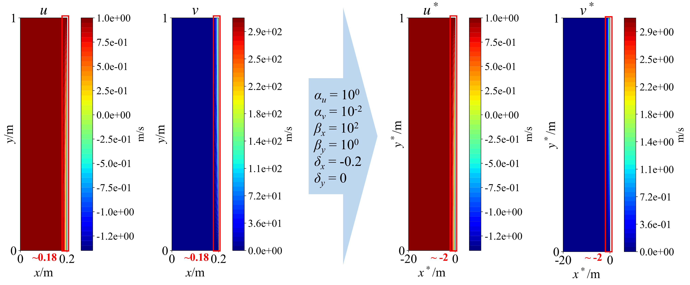

# VLT-PINN
Variable linear transformation improved physics-informed neural networks (VLT-PINNs) for thin-layer flow problems.  
The code for the paper: [*Variable linear transformation improved physics-informed neural networks to solve thin-layer flow problems*](https://doi.org/10.1016/j.jcp.2024.112761).

## Shear flows (Case 1-8)

Free jet:

Mixing layer:

Flat-plate boundary layer (left) and wake flow (right):

## Illustration of VLT

Case 1:

Case 10:

## Corrigendum

In our paper, equation (25) is missing the root signs.

Original equation:

$$
L_2RE_{\varphi} = \frac{ \sum\limits_{i=1}^{n} (\varphi_{i, true} - \varphi_{i, pred})^2 }{ \sum\limits_{i=1}^{n} \varphi^2_{i, true} }
$$

Correct equation:

$$
L_2RE_{\varphi} = \frac{ \Vert\varphi_{true} - \varphi_{true}\Vert_2 }{ \Vert\varphi_{true}\Vert_2 } = \frac{ \sqrt{\sum\limits_{i=1}^{n} (\varphi_{i, true} - \varphi_{i, pred})^2} }{ \sqrt{\sum\limits_{i=1}^{n} \varphi^2_{i, true}} }
$$
